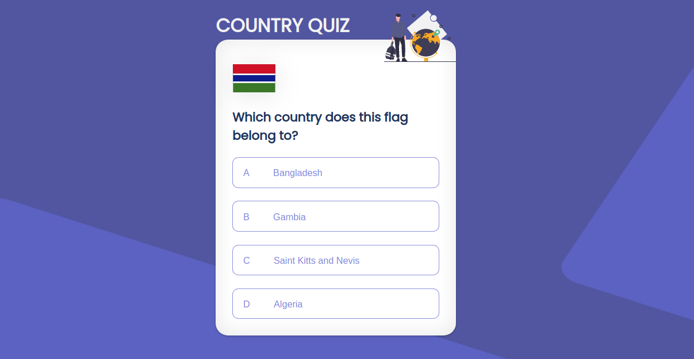
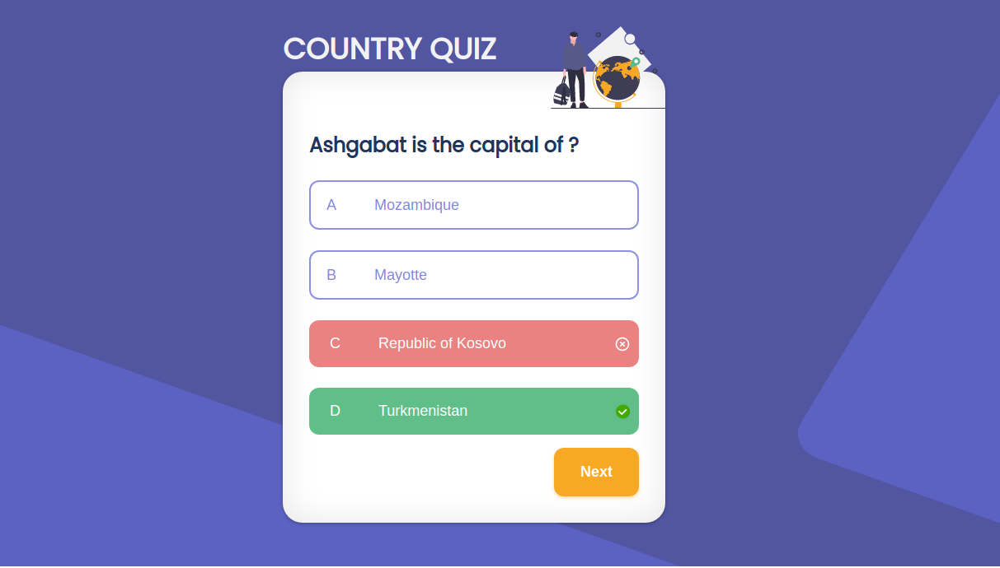
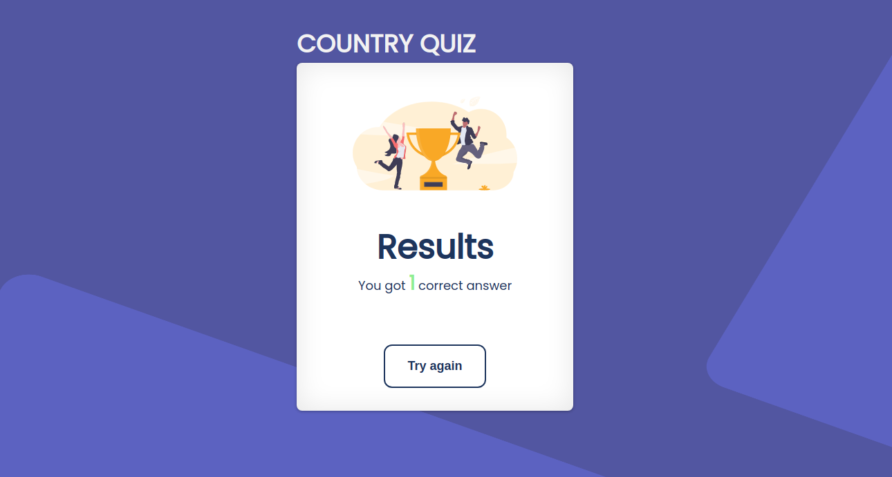

<h1 align="center">Country Quiz</h1>

<div align="center">
  <h3>
    <a href="https://github.com/Voninkazo/country-quiz">
      Demo
    </a>
    <span> | </span>
    <a href="https://sandy-country-quiz.netlify.app/">
      Solution
    </a>
  </h3>
</div>

## Overview





### Built With

<!-- This section should list any major frameworks that you built your project using. Here are a few examples.-->

- [React](https://reactjs.org/)
- [Sass]()
- [Jsx]()

## Features

<!-- List the features of your application or follow the template. Don't share the figma file here :) -->

## How To Use

<!-- Example: -->

To clone and run this application, you'll need [Git](https://git-scm.com) and [Node.js](https://nodejs.org/en/download/) (which comes with [npm](http://npmjs.com)) installed on your computer. From your command line:

```bash
# Clone this repository
$ git clone https://github.com/your-user-name/your-project-name

# Install dependencies
$ npm install

# Run the app
$ npm start
```

## Design

[ https://www.figma.com/file/Gw0ZNBbYN8asqFlZWy3jG1](https://www.figma.com/file/Gw0ZNBbYN8asqFlZWy3jG1)
